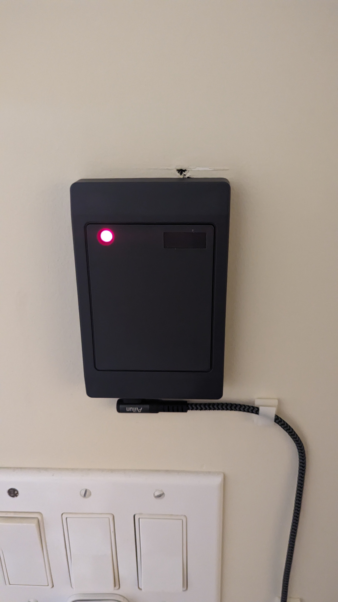
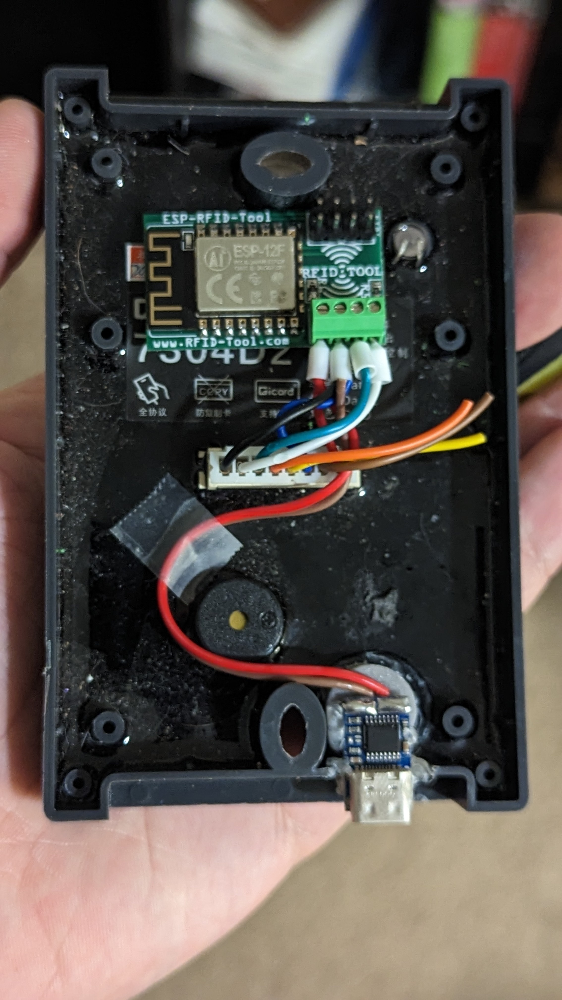

# ESPHome-RFID-Reader
ESPHome RFID Reader using the [ESP RFID Tool](https://github.com/rfidtool/ESP-RFID-Tool) and [a cheap dual frequency Wiegand Reader](https://www.aliexpress.com/item/3256803106772583.html)

## Bill of Materials

- [ESP RFID Tool](https://github.com/rfidtool/ESP-RFID-Tool)
- [7304D2 Dual Frequency Wiegand Reader](https://www.aliexpress.com/item/3256803106772583.html) (Or any RFID/NFC wiegand reader that has room for the ESP on the back)
- [12V USB-C PD Decoy Trigger Module](https://www.aliexpress.com/item/3256805078382919.html) (Make sure to get the 12v version)

## Wiring

### Wiring Notes
- ****Make sure you do not connect the 12v power to the header pins on the top of the ESP RFID tool board! I burned up one ESP RFID Tool board by doing that. Only the green screw terminal connector is hooked up to the voltage regulator so make sure you hook the 12v line to that connector**

-  Using wire ferrules can make the wiring much easier since the wires are so thin
  

### Software
1. Create a new device in ESPHome using [this yaml file](officerfid.yaml)
2. Download the .bin file for your new device from ESPHome
3. Connect to the SSID: `ESP-RFID-Tool` and browse to http://192.168.1.1
   - Deafult login: `admin`/`rfidtool`
4. Navigate to the "Upgrade Firmware" page and upload the .bin file you got from ESPHome

### TODO
- Make annotated wiring diagram 
